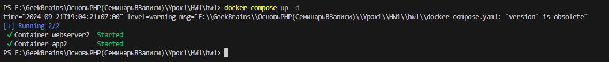
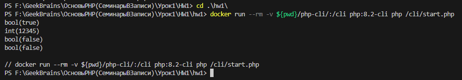
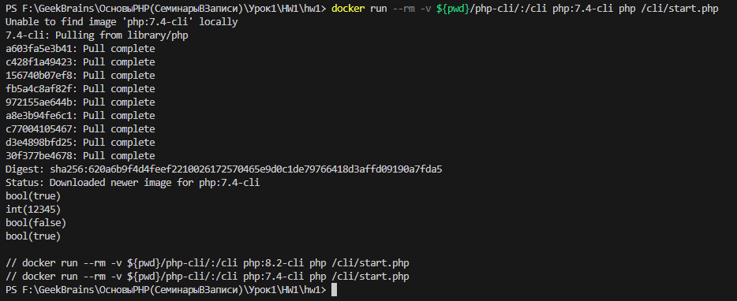
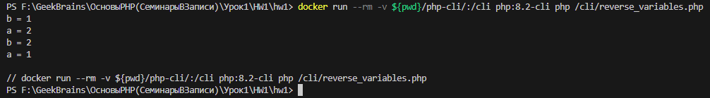

### Задание 1:
    Собрать для себя окружение из Nginx + PHP-FPM и PHP CLI



Рис.1: Связка контейнеров Nginx + PHP-FPM



Рис.2: Выполнение кода в php-cli 8.2

### Задание 2:
    Выполните код в контейнере PHP CLI и объясните, что выведет данный код и почему:


Рис.3: Выполнение кода в php-cli 8.2

```
<?php
$a = 5; \\ - это переменная равная числу 5
$b = '05'; \\ - это переменная равная строке '05'
var_dump($a == $b); \\ - var_dump выводит тип и значение переменной: результат не строгого сравнения типа bool равен true, так как переменная $b преобразуется к числу 5
var_dump((int)'012345'); \\ - var_dump выводит тип и значение переменной: строка '012345' преобразуется к числу
var_dump((float)123.0 === (int)123.0); \\ - var_dump выводит тип и значение переменной: результат строгого сравнения типа bool равен false, так как первый операнд преобразуется к типу float, а второй к типу int
var_dump(0 == 'hello, world'); \\ - var_dump выводит тип и значение переменной: результат не строгого сравнения типа bool равен false, так как значения опреандов не равны
?>
```

### Задание 3:
    В контейнере с PHP CLI поменяйте версию PHP с 8.2 на 7.4. Изменится ли вывод?


Рис.4: Выполнение кода в php-cli 7.4

Как видим вывод не изменился.

### Задание 4:
    Используя только две числовые переменные, поменяйте их значение местами. Например, если a = 1, b = 2, надо, чтобы получилось: b = 1, a = 2. Дополнительные переменные, функции и конструкции типа list() использовать нельзя.

```
<?php
    $b = 1;
    $a = 2;
    echo 'b = '.$b.PHP_EOL;
    echo 'a = '.$a.PHP_EOL;
    $a = $a + $b;
    $b = $a - $b;
    $a = $a - $b;
    echo 'b = '.$b.PHP_EOL;
    echo 'a = '.$a.PHP_EOL;
?>
```

Рис.5: Обмен значений переменных в php-cli 8.2
